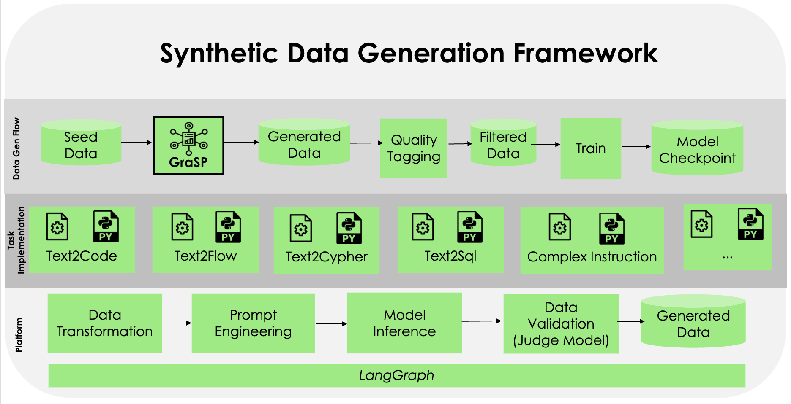

<div align="center">
  

  <h1>GRASP: GRAph-oriented Synthetic data generation Pipeline</h1>
</div>


Framework to easily generate complex synthetic data pipelines by visualizing and configuring the pipeline as a
computational graph. [langgraph](https://python.langchain.com/docs/langgraph/) is used as the underlying graph
configuration/execution library. Refer
to [langraph examples](https://github.com/langchain-ai/langgraph/tree/main/examples) to get a sense of the different
kinds of computational graph which can be configured.
<br>
<be>
<!--  
<br> -->

## Introduction

GraSP Framework is created to generate synthetic data. As it is a complex process to define the flow, this design simplifies the synthetic data generation process. GraSP platform will support the following:
- Defining the seed data configuration
- Define a task, which involves graph node configuration, flow between nodes and conditions between the node
- Define the output location to dump the generated data

Seed data can be pulled from either Huggingface or file system. Once the seed data is loaded, GraSP platform allows datagen users to write any data processing using the data transformation module. When the data is ready, users can define the data flow with various types of nodes. A node can also be a subgraph defined in another yaml file.

Each node can be defined with preprocessing, post processing, and LLM prompt with model parameters. Prompts can use seed data as python template keys.  
Edges define the flow between nodes, which can be conditional or non-conditional, with support for parallel and one-to-many flows.

At the end, generated data is collected in the graph state for a specific record, processed further to generate the final dictionary to be written to the configured data sink.


---

## Components

GraSP supports extendability and ease of implementation—most tasks are defined as graph configuration YAML files. Each task consists of two major components: a graph configuration and Python code to define conditions and processors.

A node is defined by the node module, supporting types like LLM call, multiple LLM call, lambda node, and sampler node.  
LLM-based nodes require a model configured in `models.yaml` and runtime parameters. Sampler nodes pick random samples from static YAML lists. For custom node types, you can implement new nodes in the platform.

You can also define connections (edges) between nodes, which control conditional or parallel data flow.

As of now, LLM inference is supported for TGI, vLLM, Azure, OpenAI and Ollama compatible servers. Model deployment is external and configured in `models.yaml`.


---

## Installation


1. Create an environment with Python `3.11` or higher, using `pyenv` or `conda`.
    * For `pyenv`, use the following commands:
        ```bash
        brew install pyenv
        pyenv install 3.11
        pyenv local 3.11
        ```
    * To set up your PATH automatically every time you open a shell session, add this to your .zshrc file:
        ```bash
        eval "$(pyenv init -)"
        ```
2. Clone the repository.

  ```
    git clone git@github.com:ServiceNow/grasp.git
  ```
3. Install poetry using the [official guidelines](https://python-poetry.org/docs/#installation).
4. Run `poetry install`.
5. (Optional) In your IDE, set your python interpreter to the poetry virtual environment.
   Run `poetry run which python` to see the python interpreter path that you should add in your IDE.

---

## Model Configuration


GraSP requires model configuration as the first step. It supports various clients like HTTP, MistralAzure, AsyncOpenAI, AsyncAzureOpenAI and Ollama to connect to inference servers (Text Generation Inference (TGI), vLLM server, Azure Cloud Service, Ollama etc.).
The `config` folder contains the main configuration file: `models.yaml`. You can add your model alias as a key and define its properties as shown below.

### Environment Variables for Credentials and Chat Templates

All sensitive connection information such as model URL and tokens **must be set via environment variables** and not stored in the config file.

For each model defined in your `models.yaml`, set environment variables as follows:
- `GRASP_<MODEL_NAME>_URL` (for the model endpoint)
- `GRASP_<MODEL_NAME>_TOKEN` (for API keys or tokens)
- If `modify_tokenizer: true` is set for a model, provide a chat template string via:
  - `GRASP_<MODEL_NAME>_CHAT_TEMPLATE`

**Naming Convention:**  
`<MODEL_NAME>` is the model’s key from your `models.yaml`, with all spaces replaced by underscores, and all letters uppercased (e.g., `mixtral 8x7b` → `MIXTRAL_8X7B`).

**Example:**  
For `mixtral_8x7b` and `gpt4`, set:
- `GRASP_MIXTRAL_8X7B_URL`, `GRASP_MIXTRAL_8X7B_TOKEN`
- `GRASP_GPT4_URL`, `GRASP_GPT4_TOKEN`
- If `mixtral_8x7b` has `modify_tokenizer: true`, set:  
  - `GRASP_MIXTRAL_8X7B_CHAT_TEMPLATE` to your custom Jinja2 chat template string

You should use a `.env` file at the project root or set these in your shell environment.

**Note:**
If you want to define a list of URLs for any model, you can use pipe (`|`) as a separator. For example, if you have a model called `mixtral_8x7b` with URLs `https://myserver/models/mixtral-8x7b` and `https://myserver/models/mixtral-8x7b-2`, you can set the following environment variables as shown in examples below. 

### Example `.env`:

```env
GRASP_MIXTRAL_8X7B_URL=https://myserver/models/mixtral-8x7b|https://myserver/models/mixtral-8x7b-2
GRASP_MIXTRAL_8X7B_TOKEN=sk-abc123
GRASP_MIXTRAL_8X7B_CHAT_TEMPLATE= ... 
```
---

### Configuration Properties

| Key                          | Description                                                                                           |
|------------------------------|-------------------------------------------------------------------------------------------------------|
| `model_type`                 | Type of backend server (`tgi`, `vllm`, `openai`, `azure`, `mistralai`, `ollama`)                       |
| `model_name`                 | Model name for your deployments (for Azure/OpenAI)                                                    |
| `api_version`                | API version for Azure or OpenAI                                                                       |
| `hf_chat_template_model_id`  | Hugging Face model ID                                                                                 |
| `completions_api`            | *(Optional)* Boolean: use completions API instead of chat completions API (default: false)            |
| `modify_tokenizer`           | *(Optional)* Boolean: apply custom chat template and modify the base model tokenizer (default: false) |
| `special_tokens`             | *(Optional)* List of special stop tokens used in generation                                           |
| `post_process`               | *(Optional)* Post processor after model inference (e.g. `models.model_postprocessor.RemoveThinkData`) |
| `parameters`                 | *(Optional)* Generation parameters (see below)                                                        |
| `ssl_verify`                 | *(Optional)* Verify SSL certificate (default: true)                                                   |
| `ssl_cert`                   | *(Optional)* Path to SSL certificate file                                                             |

> **Note:**  
> - Do **not** include `url`, `auth_token`, or `api_key` in your YAML config. These are sourced from environment variables as described above.<br>
> - If you want to set **ssl_verify** to **false** globally, you can set `ssl_verify:false` under `model_config` section in config/configuration.yaml

#### Customizable Model Parameters

- `temperature`: Sampling randomness (0.0–2.0; lower is more deterministic)
- `top_p`: Nucleus sampling (0.0–1.0)
- `max_tokens` / `max_new_tokens`: Maximum number of tokens to generate
- `stop`: List of stop strings to end generation
- `repetition_penalty`: Penalizes repeated tokens (1.0 = no penalty)
- `presence_penalty`: (OpenAI only) Encourages novel tokens
- `frequency_penalty`: (OpenAI only) Penalizes frequently occurring tokens

The model alias set as a key in the configuration is referenced in your graph YAML files (for node types such as `llm` or `multi_llm`). You can override these model parameters in the graph YAML for specific scenarios.

---

### Example Configuration (`models.yaml`)

```yaml
mixtral_8x7b:
  model_type: vllm
  hf_chat_template_model_id: meta-llama/Llama-2-7b-chat-hf
  modify_tokenizer: true
  parameters:
    temperature: 0.7
    top_p: 0.9
    max_new_tokens: 2048

gpt4:
  model_type: azure
  model_name: gpt-4-32k
  api_version: 2024-05-01-preview
  parameters:
    max_tokens: 500
    temperature: 1.0

qwen_2.5_32b_vl:
  model_type: vllm
  completions_api: true
  hf_chat_template_model_id: Qwen/Qwen2.5-VL-32B-Instruct
  parameters:
    temperature: 0.15
    max_tokens: 10000
    stop: ["<|endoftext|>", "<|im_end|>", "<|eod_id|>"]

qwen3_1.7b:
  hf_chat_template_model_id: Qwen/Qwen3-1.7B
  post_process: core.models.model_postprocessor.RemoveThinkData
  model_type: ollama
  parameters:
    max_tokens: 2048
    temperature: 0.8

```

> **Important:**
If you set modify_tokenizer: true for a model, you must provide the corresponding chat template in your environment as GRASP_<MODEL_NAME>_CHAT_TEMPLATE.
Otherwise, exception will be raised during the model initialization.
---

## Steps to Create a Synthetic Data Pipeline

With the graph node and edge YAML configuration, it's easy to set up a flow.  
Example: [code_generation_with_graph_builder](tasks/mbpp/code_generation_with_graph_builder).

**Basic steps:**
- Create a sub-directory under `tasks` for your use case.
- Create a `graph_config.yaml` for your pipeline (nodes, edges, models, etc).
- Create a `task_executor.py` for any custom logic or processing.
- Execute with `python main.py --task <your_task> ...`
- Results are stored in `output.json` in your sub-directory.

#### Resumable Execution: 

In the event of a failure, the process can gracefully shut down and later resume execution from the point of interruption. To activate resumable execution, set the flag `--resume True` when running your command. For instance: `python main.py --task <your_task> ... --resume True`. 

> See the [Graph Configuration Guide](docs/graph_config_guide.md) for detailed schema, examples, and best practices for defining graphs, tasks, and processors.

---

## Creating Task with UI 

### Run the UI Service

The UI for this project is built using Streamlit and is located in the `apps` directory. To launch the GraSP UI locally, use the provided shell script:

```bash
./run_ui.sh
```

If you're running it for the first time, make sure the script is executable:
```bash
chmod +x run_ui.sh
```

To run it on a custom port (e.g., 8502):
```bash
./run_ui.sh 8502
```
By default, the app will be available at: http://localhost:8501

### Steps to create task

The Streamlit-based user interface provides a comprehensive set of tools to manage models and configure task flows in an interactive manner. Below are the key features:

#### 1. Model Management
Users can view all registered models along with their current status (active or inactive). The interface allows manual refreshing of model statuses to ensure accuracy. Additionally, users can register new models by providing essential details such as base URL, model name, type, and any custom configuration parameters.

#### 2. Review Existing Tasks
Users can explore previously defined task flows through an interactive visual interface. This includes:
- Viewing the task's directed graph structure
- Inspecting individual node configurations
- Understanding the data flow and logic for each task

#### 3. Create a New Task Flow from Scratch
The UI guides users through the complete process of creating a new task flow:
- Filling in `data_config` parameters
- Constructing the task graph by defining nodes and edges
- Defining the `output_config` section
- Automatically generating the required `graph_config.yaml` and `task_executor.py` files
- Reviewing and publishing the complete task setup

#### 4. Create a New Task Flow Based on Existing Flows
Users can use existing task flows as templates, modify them as needed, and publish new customized task flows. This streamlines the task creation process by leveraging previously defined components.

---

## Documentation

For a **complete reference** of all YAML configuration options, node/edge types, data sources and sinks, output mapping, schema validation, and advanced features:

👉 **See the [Graph Configuration Guide](docs/graph_config_guide.md)**

---

## License

[Your license here]

---

**Questions?**  
Open an issue or discussion! Contributions are welcome.

